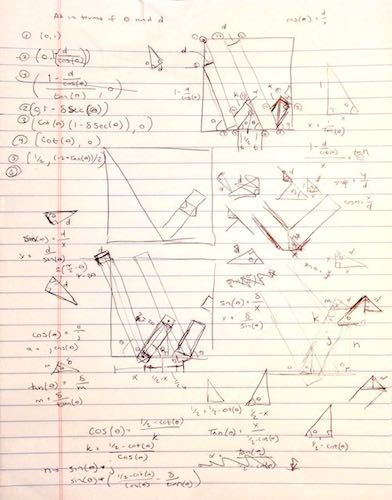

# Logo Design

The design of the logo on this site is based on a "William" logo I created in a high school class using AutoCAD. I tried using several different design applications including Pixelmator, Assembly (iOS), and a couple of other iPhone apps. I ultimately decided to use Wolfram Language for its mathematical precision.
      
The desired properties of the logo were that:

1. the logo be contained within a perfect square,
2. the top left corner of the enclosing square intersect with the right-most boundary of the left-most portion of the "W",
3. the "W" be perfectly centered,
4. the "dot" on the "i" be a perfect square,
5. all segments of the "W" have the same width `δ`,
6. the distance between the "dot" and the base of the "i" `i` be less than or equal to `δ`, and
7. all segments be at the same angle `ϴ` (or its supplement) with respect to the x-axis.

Given these contraints, I dusted off my memories of trigonometry and went to work putting all points of interest in terms of `δ`, `ϴ`, and `i`:



I then `Simplify[]`'d the points using Wolfram Language and put them in a `Manipulate[]` so I could quickly and easily see how the logo looked with different values of `δ`, `ϴ`, and `i`. I also created a variable in the `Manipulate[]` for the background color. Initially, I created polygons for the five rectangular segments of the "W". However, I wanted the "W" itself to be transparent, so I ended up creating polygons for the surrounding "background". There was no need to keep the polygons within the enclosing square region since I could set the plot range to clip everything outside of that square.

Here is the final code used to create my logo:

```
Manipulate[
  With[{
      lowerEndPoint = {
        (3 - 4*Cot[ϴ] + δ*Csc[ϴ] + 2*δ*Sin[ϴ])/2,
        (-2 - 2*δ*Cos[ϴ] + δ*Sec[ϴ] + Tan[ϴ])/2
      },
      upperEndPoint = {
        (3 - 4*Cot[ϴ] + δ*Csc[ϴ])/2,
        (-2 + δ*Sec[ϴ] + Tan[ϴ])/2
      }
    },
    Graphics[{
        EdgeForm[],
        c,
        Polygon[{
          {
            {0, 1 - δ*Sec[ϴ]},
            {Cot[ϴ] - δ*Csc[ϴ], 0},
            {0, 0}
          },
          {
            {Cot[ϴ], 0},
            {1/2, (-2 + Tan[ϴ])/2},
            {1 - Cot[ϴ], 0}
          },
          {
            {1 - Cot[ϴ] + δ*Csc[ϴ], 0},
            lowerEndPoint + {(2 + δ)*Cos[ϴ], (2 + δ)*Sin[ϴ]},
            {1, 0}
          },
          {
            lowerEndPoint,
            upperEndPoint,
            upperEndPoint + {i*Cos[ϴ], i*Sin[ϴ]},
            lowerEndPoint + {i*Cos[ϴ], i*Sin[ϴ]}
          },
          {
            upperEndPoint, {1 - Cot[ϴ] + (1/2)*δ*Csc[ϴ], (δ*Sec[ϴ])/2},
            {1 - 2*Cot[ϴ] + δ*Csc[ϴ], 1},
            upperEndPoint + {(2 + δ)*Cos[ϴ], (2 + δ)*Sin[ϴ]}
          },
          {
            lowerEndPoint + {(i + δ)*Cos[ϴ], (i + δ)*Sin[ϴ]},
            upperEndPoint + {(i + δ)*Cos[ϴ], (i + δ)*Sin[ϴ]},
            upperEndPoint + {(2 + δ)*Cos[ϴ], (2 + δ)*Sin[ϴ]},
            lowerEndPoint + {(2 + δ)*Cos[ϴ], (2 + δ)*Sin[ϴ]}
          },
          {
            {1 - 2*Cot[ϴ], 1},
            {(1 - δ*Csc[ϴ])/2, (-2 + δ*Sec[ϴ] + Tan[ϴ])/2},
            {Cot[ϴ] - (δ*Csc[ϴ])/2, (δ*Sec[ϴ])/2},
            {0, 1}
          }
        }]
      },
      PlotRange -&gt; {{0, 1}, {0, 1}},
      Background -&gt; None
    ]
  ],
  {
    {δ, 0.1785}, 0, 1/4},
    {{ϴ, 1.215}, (3*Pi)/8, (5*Pi)/12},
    {{i, 0.1785}, 0, δ},
    {c, RGBColor["#3E65A4"]},
    LabelStyle -&gt; "Text"
  ]
]
```

You can see this code in action via [this Wolfram Cloud deployment](https://www.wolframcloud.com/objects/user-19f75108-9435-49b6-8a25-ff7099d88593/Logo). It looks like this:


